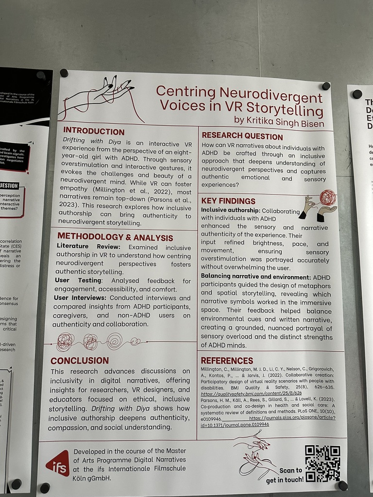
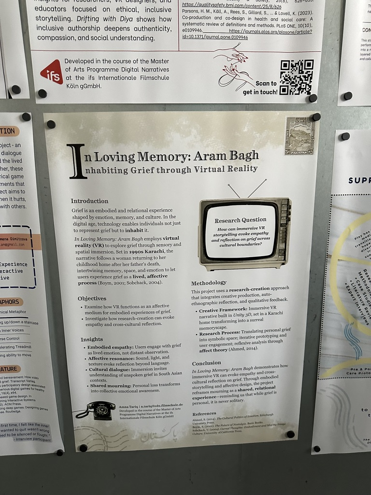
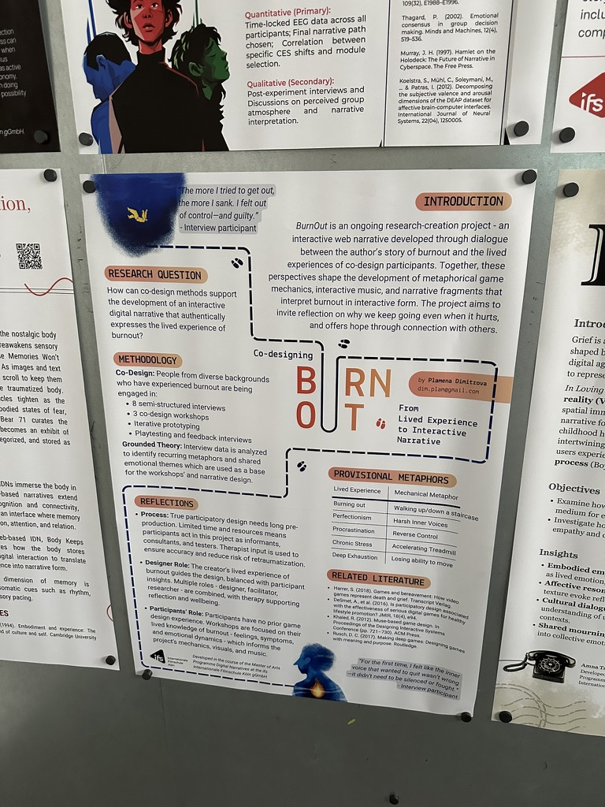

Každý student si připraví jednoduchý poster formátu A1, ve kterém nastíní základy projektu – jeho cíle a postupy řešení

Na konci diplomního semináře (poslední hodina) pořádáme velkou posterovou sekci (s více než 30 studenty), kde studenti prezentují svůj výzkum a to jak svým kolegům, tak i nám, členům katedry. Shromažďují zpětnou vazbu a trénují své prezentační dovednosti. A doufáme, že tato akce poslouží i jako příjemné seznámení mezi katedrou a studenty 😄

Níže jsou instrukce a doporučení, jak takový poster připravit

# Ukázky

# NÁZEV PROJEKTU +

---

**[Jasný, výstižný název max. 15 slov]**

**Příklady:**

- "Vliv virtuálních lesních prostředí na emocionální pohodu uživatelů"
- "Prostorová navigace ve virtuální realitě: Srovnání s reálným prostředím"
- "Klimatická úzkost u mladých dospělých: Validizace českého dotazníku"

**Řešitel/ka / Researcher:**
Jméno Příjmení
[email@example.cz](mailto:email@example.cz)

**Školitel/ka / Supervisor:**
Prof./Dr. Jméno Příjmení

**Instituce:**
Katedra psychologie a přírodních věd
Fakulta humanitních studií
Univerzita Karlova

---

### 1. ÚVOD

**Co sem patří:**

- Kontext a pozadí problému (2-3 věty)
- Proč je téma společensky/vědecky relevantní
- Krátké představení klíčových konceptů
- Gap v současném poznání

**Příklad 1 (VR a příroda):**
"Kontakt s přírodou má prokazatelně pozitivní vliv na psychickou pohodu člověka (Kaplan, 1995). S rozvojem virtuální reality (VR) se otevírá otázka, zda digitální reprezentace přírodních prostředí může nabídnout podobné benefity jako reálná příroda. Dosavadní studie ukazují smíšené výsledky, přičemž chybí výzkumy s detailní digitální reprezentací prostředí založenou na LiDAR datech."

**Příklad 2 (Klimatická psychologie):**
"Klimatická změna představuje jednu z největších výzev současnosti, přičemž její psychologické dopady na jedince zůstávají nedostatečně zmapované. Koncept klimatické úzkosti (climate anxiety) získává na významu, avšak v českém prostředí chybí validizované nástroje pro její měření. Mezinárodní studie naznačují, že mladí dospělí jsou klimatickou úzkostí zasaženi nejsilněji."

---

### 2. VÝZKUMNÝ PROBLÉM

**Co sem patří:**

- Jasně formulovaný problém, který studie řeší
- Konkrétní mezera v poznání
- Hlavní výzkumná otázka
- Specifické dílčí otázky nebo hypotézy (2-4)

**Příklad (VR a příroda) - Kvalitativní přístup:**

**Výzkumný problém:**
"Zatímco je prokázáno, že reálné lesní prostředí má restaurativní efekt, není jasné, jak uživatelé subjektivně vnímají a prožívají vysoce realistické virtuální lesní prostředí vytvořené pomocí LiDAR skenování."

**Hlavní výzkumná otázka:**
"Jak lidé subjektivně prožívají ponořovací zkušenost ve vysoce realistickém virtuálním lesním prostředí?"

**Dílčí otázky:**

1. Jaké emocionální reakce vyvolává VR lesní prostředí?
2. Jaké aspekty virtuálního lesa uživatelé považují za důležité pro pocit přítomnosti?
3. Jak se liší prožitek VR lesa od vzpomínek na reálný les?

---

### 3. METODOLOGIE

### 3.1 VÝZKUMNÁ STRATEGIE

**Co sem patří:**

- Typ výzkumu (kvalitativní/kvantitativní/smíšený)
- Stručné zdůvodnění volby
- Design studie (experimentální, korelační, fenomenologický atd.)

**Příklad 1:**
"**Kvalitativní výzkum** 
Zaměřujeme se na subjektivní prožitek a významy, které účastníci přisuzují zkušenosti s VR lesním prostředím. Fenomenologický přístup umožňuje zachytit bohatost individuálního prožívání.

**Příklad 2:**
"**Kvantitativní výzkum**
Experimentální studie: Zaměřujeme se na měření a analýzu vlivu VR prostředí na emoční procesy. Použijeme standardizované testy a metody sběru dat, abychom zajistili objektivitu a replikovatelnost výsledků.

### 3.2 ÚČASTNÍCI VÝZKUMU

**Co sem patří:**

- Charakteristika vzorku
- Velikost vzorku (s odůvodněním)
- Kritéria výběru (inkluze/exkluze)
- Způsob rekrutace
- Typ vzorku (náhodný, účelový, snowball atd.)

**Příklad 1 (Kvalitativní):Účastníci:** N = 15-20 dospělých (25-45 let)
**Charakteristika:** Lidé s různou mírou zkušenosti s VR (od žádné po pravidelné uživatele)
**Kritéria výběru:**
- Inkluze: Věk 25-45 let, dobrý zdravotní stav, schopnost českého jazyka
- Exkluze: Závažné oční vady nekorigované brýlemi, epilepsie, kinetóza
**Rekrutace:** Kombinace - inzerce na univerzitě, sociální sítě, snowball sampling
**Typ vzorku:** Příležitostný vzorek s cílem maximalizovat variabilitu zkušeností s VR

### 3.3 NÁSTROJE SBĚRU DAT 

**Co sem patří:**

- Konkrétní techniky a nástroje
- Autor nástroje, rok
- Krátký popis každého nástroje
- Způsob administrace
- Časový průběh sběru

**Příklad 1 (Kvalitativní):**

**Polostrukturovaný individuální rozhovor**

- Trvání: 45-60 minut
- Místo: FHS UK, klidná místnost
- Tematické oblasti:
    - První dojem z VR lesa (otázka: "Popište mi, co jste prožívali, když jste poprvé vstoupili do virtuálního lesa.")
    - Emocionální reakce (otázka: "Jaké emoce ve vás prostředí vyvolávalo?")
    - Pocit přítomnosti (otázka: "Nakolik jste měli pocit, že 'skutečně' jste v lese?")
    - Srovnání s reálným lesem (otázka: "Jak byste porovnali tuto zkušenost s vaší vzpomínkou na skutečný les?")
    - Prvky prostředí (otázka: "Co přispívalo k tomu, že prostředí působilo realisticky/nerealisticky?")

**Pozorování během VR expozice**

- Zaznamenávání nonverbálního chování
- Spontánní výroky během expozice
- Doba strávená v různých částech virtuálního prostředí

**Průběh:**

1. Úvodní instrukce a informovaný souhlas (10 min)
2. Volná explorace VR lesa (15 min) - s pozorováním
3. Krátká přestávka (5 min)
4. Polostrukturovaný rozhovor (45-60 min) - audio záznam
5. Demografický dotazník (5 min)

**Příklad 2 (Kvantitativní):**

**Climate Anxiety Scale (CAS; Clayton & Karazsia, 2020)**

- 13 položek, 2 subškály (Cognitive-Emotional Impairment, Functional Impairment)
- Likertova škála 1-5 (nikdy - téměř vždy)
- Adaptace: Překlad do češtiny metodou zpětného překladu, pilotáž na 30 respondentech
- Příklad položky: "Myslím na klimatickou změnu, i když to nechci."

**Generalized Anxiety Disorder Scale (GAD-7; Spitzer et al., 2006)**

- 7 položek měřících obecnou úzkost
- Použito pro testování diskriminační validity
- Česká validizovaná verze

**Environmental Engagement Scale (vlastní konstrukce)**

- 10 položek měřících míru environmentální angažovanosti
- Oblasti: recyklace, konzumní chování, aktivismus, informovanost
- Použito pro testování konvergentní validity

**Demografický dotazník**

- Věk, pohlaví, vzdělání, bydliště (město/venkov)
- Politická orientace (5-bodová škála)
- Členství v environmentálních organizacích (ano/ne)

**Administrace:**

- Online platforma (Google Forms)
- Trvání: 15-20 minut
- Sběr dat: březen-duben 2025

**Příklad 3  (Experiment):**

**Navigační úkol**

- Labyrint 8×8 metrů (reálný)
- Cíl: Nalézt 4 cílové lokace v co nejkratším čase
- Měřené proměnné:
    - Celkový čas (sekundy)
    - Počet chyb (špatné zatáčky)
    - Ušlá vzdálenost (metry)
    - Preference strategie - test po úkolu

**Santa Barbara Sense of Direction Scale (SBSOD; Hegarty et al., 2002)**

- 15 položek měřících subjektivní navigační schopnosti
- Použito pro kontrolu inter-individuálních rozdílů

**Simulator Sickness Questionnaire (SSQ; Kennedy et al., 1993)**

- Pouze pro VR skupinu
- Před a po expozici
- Kontrola vedlejších efektů VR

**Technické vybavení:**

- VR: Meta Quest 3, ambisonic zvuk, haptická vesta
- Tracking: Vicon motion capture systém
- Reálné prostředí: Značené trasy, GoPro kamera

**Průběh experimentu:**

1. Příchod a informovaný souhlas (10 min)
2. Předtestové dotazníky: SBSOD, SSQ-VR skupina (10 min)
3. Instrukce k úkolu (5 min)
4. Navigační úkol v přiděleném prostředí (15-20 min)
5. Post-test: SSQ-VR skupina, test strategie (10 min)

### 3.4 ANALYTICKÉ POSTUPY

**Co sem patří:**

- Způsob přípravy dat
- Konkrétní analytické metody
- Software, který bude použit
- Postupné kroky analýzy

**Příklad 1 (Kvalitativní):**

**Příprava dat:**

- Doslovná transkripce audio záznamů rozhovorů
- Anonymizace údajů
- Import do Atlas.ti

**Analytický postup:**

- **Interpretativní fenomenologická analýza (IPA)**
    1. Opakované čtení transkriptů
    2. Initiální noting (deskriptivní, lingvistické, konceptuální komentáře)
    3. Identifikace emergentních témat u každého případu
    4. Hledání spojení napříč tématy
    5. Hledání vzorců napříč případy
    6. Vytvoření finální tematické struktury

**Zajištění kvality:**

- Triangulace: Kombinace rozhovoru a pozorování
- Member checking: Poskytnutí shrnutí témat participantům k validizaci
- Peer debriefing: Diskuse analýzy s druhým výzkumníkem
- Reflexivní deník: Dokumentace vlastních předpokladů a reakcí

**Software:** Atlas.ti 24

**Příklad 2 (Kvantitativní):**

**Příprava dat:**

- Export z Qualtrics do SPSS
- Screening chybějících dat (strategie: vyloučit případy s >20% missings)
- Kontrola outlierů (z-skóre > ±3.29)
- Testování normality distribuce (Shapiro-Wilk test)

**Analytické kroky:**

**Deskriptivní statistika**

- Průměry, směrodatné odchylky pro všechny položky
- Distribuce odpovědí

**Reliabilita**

- Cronbachova alpha pro celou škálu i subškály (očekáváno α > 0.80)
- Item-total korelace (očekáváno r > 0.30)
- Split-half reliabilita

**Testování hypotéz**

- H2: Independent samples t-test (CAS skóre: ženy vs. muži)
- H4: Independent samples t-test (CAS skóre: 18-25 vs. 26-40 let)
- Efekt velikosti: Cohenovo d

**Software:**

- JASP pro deskriptivní statistiku a reliabilitu

**Příklad 3 (Experiment):**

**Příprava:**

- Kontrola předpokladů pro parametrické testy

**Hlavní analýzy:**

1. **ANOVA (mezi-subjektový design)**
    - DV: Navigační čas, počet chyb, vzdálenost
    - IV: Typ prostředí (VR vs. reálné)
    - Kovariate: SBSOD skóre, věk, pohlaví
    - Post-hoc: Bonferroni korekce
    - Velikost efektu : Partial eta-squared
2. **Chí-kvadrát test**
    - Rozdíly v preferenci navigační strategie mezi skupinami
3. **Kontrola vedlejších efektů VR**
    - Párový t-test pro SSQ (před vs. po)

**Software:** JASP

---

### 4. OČEKÁVANÉ PŘÍNOSY

**Co sem patří:**

- Teoretický přínos (co přidává k poznání)
- Praktický/aplikační přínos (jak lze využít)
- Metodologický přínos (pokud relevantní)
- Společenský přínos (pokud relevantní)

**Příklad (VR a příroda):**

**Teoretický přínos:**

- Prohloubení porozumění mechanismům restaurativního efektu přírodních prostředí
- Rozšíření Kaplanovy Attention Restoration Theory o digitální prostředí
- Identifikace klíčových faktorů virtuálního prostředí ovlivňujících pocit přítomnosti

**Praktický přínos:**

- Design guidelines pro tvorbu terapeutických VR aplikací
- Možnosti využití pro lidi s omezenou mobilitou
- Podpora pro urban planning (virtuální simulace zelených ploch)

**Aplikační potenciál:**

- Relaxační VR aplikace pro stresové prostředí (nemocnice, kanceláře)
- Doplněk k psychoterapii úzkostných poruch
- Nástroj pro environmentální vzdělávání

---

### 5. LIMITY A RIZIKA

**Co sem patří:**

- Identifikace slabých míst designu
- Možné zdroje systematické chyby
- Omezení generalizovatelnosti
- Etická rizika
- Způsoby, jak limity ošetřujete/zmírníte

**Příklad:**

**Limity výběru vzorku:**

- **Riziko:** Účelový vzorek nemusí zachytit plnou variabilitu prožívání
- **Navrhované řešení:** Strategie maximální variability, aktivní vyhledávání různých profilů uživatelů

**Subjektivita interpretace:**

- **Riziko:** Interpretace ovlivněna předporozuměním výzkumníka
- **Navrhované řešení:** Reflexivní deník, peer debriefing, member checking

**Novost zkušenosti:**

- **Riziko:** Prožitek může být ovlivněn novou/neznalou technologií
- **Navrhované řešení:** Čas na familiarizaci s VR před vlastním výzkumem (5-10 min trénink)

**Umělé prostředí laboratoře:**

- **Riziko:** Laboratoř neodpovídá přirozeným podmínkám kontaktu s přírodou
- **Navrhované řešení:** Upozornění na tento limit v interpretaci, návazný výzkum v terénu

**Omezená přenositelnost:**

- **Riziko:** Nálezy specifické pro použitou VR technologii a konkrétní les
- **Navrhované řešení:** Detailní popis technologie a prostředí, připravení pro replikace

- **Riziko:** Převaha studentů humanitních oborů, omezená generalizovatelnost
- **Navrhované řešení:** Aktivní rekrutace z různých fakult, váhování dat podle populačních charakteristik

**Self-report bias:**

- **Riziko:** Sociální desirabilita, tendence odpovídat v souladu s očekáváním
- **Navrhované řešení:** Anonymita dotazníku, randomizace pořadí položek, kontrolní položky

**Kulturní adaptace nástroje:**

- **Riziko:** Koncept klimatické úzkosti může být v ČR chápán jinak než v USA
- **Navrhované řešení:** Kvalitativní pilotáž s kognitivními rozhovory (N=10) před hlavním sběrem

**Online sběr:**

- **Riziko:** Nižší kontrola nad podmínkami vyplňování
- **Navrhované řešení:** Attention check položky, časové limity pro detekci neprůkazného vyplňování

**Mezi-subjektový design:**

- **Riziko:** Individuální rozdíly mezi skupinami
- **Navrhované řešení:** Randomizace, kontrola pomocí SBSOD jako kovarianty, větší vzorek

**Jednorázové měření:**

- **Riziko:** Efekt učení není zachycen, nelze sledovat vývoj dovedností
- **Navrhované řešení:** Disclosure tohoto limitu, plán longitudinální follow-up studie

**Experimenter bias:**

- **Riziko:** Neúmyslné ovlivnění účastníků instrukcemi
- **Ošetření:** Standardizované instrukce (nahrané audio), experimenter blind k hypotézám

---

### 6. HARMONOGRAM

**Co sem patří:**

- Hlavní fáze projektu
- Časový odhad pro každou fázi
- Milníky (klíčové body dokončení)

**Příklad:**

`LEDEN 2025
- Finalizace designu a etický souhlas
- Pilotáž nástrojů (N=10)

ÚNOR - BŘEZEN 2025
- Hlavní sběr dat
- Průběžná kontrola kvality dat

DUBEN 2025
- Přepisy rozhovorů
- Data entry a cleaning

KVĚTEN - ČERVEN 2025
- Analýza dat
- První draft výsledků

ČERVENEC 2025
- Psaní práce
- Konzultace s vedoucím

SRPEN 2025
- Finalizace textu
- Odevzdání práce`

---

### 7. LITERATURA

**Co sem patří:**

- 3-5 nejdůležitějších zdrojů
- Klíčové teorie
- Hlavní empirické studie, na které navazujete
- Formát dle APA 7

**Příklad:**

Clayton, S., & Karazsia, B. T. (2020). Development and validation of a measure of climate change anxiety. *Journal of Environmental Psychology, 69*, 101434.

Kaplan, S. (1995). The restorative benefits of nature: Toward an integrative framework. *Journal of Environmental Psychology, 15*(3), 169-182.

Nukarinen, T., et al. (2022). Measures and modalities: Multimodal virtual natural environments for well-being. *Frontiers in Virtual Reality, 3*, 827629.

---
